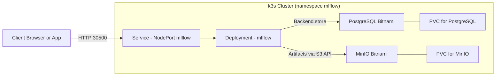

# MLflow 3.4 on K8s Rancher Desktop with Helm (LLMOps-ready, local dev stack)

Run a complete MLflow stack on your laptop (Rancher Desktop/k3s) for testing and learning. One command to install, easy to reset, local‑only by default.

Version note
- Default chart pins MLflow server to a stable 3.3.x image. You can switch to 3.4 in “Choose an MLflow version”.

## Who is this for
- Developers and students learning MLflow/LLMOps on a laptop
- Rapid POCs and workshops (no cloud required)
- Safe sandbox for tracking experiments, LLM prompts, artifacts

## What you get (locally)
- MLflow Tracking UI via NodePort (http://localhost:30500)
- PostgreSQL backend store (Bitnami) + MinIO artifacts (S3‑compatible)
- Small footprint defaults for k3s (Rancher Desktop)

## What this is NOT
- Production deployment (no TLS, no HA, demo creds)
- Multi‑tenant or hardened for external exposure (keep it local)

## 5‑minute quick start (Windows, PowerShell)
Prereqs: Rancher Desktop (k3s enabled), kubectl, Helm 3.

```powershell
# 1) Create namespace
kubectl create namespace mlflow

# 2) Pull dependencies and install
helm repo add bitnami https://charts.bitnami.com/bitnami
cd helm\mlflow-stack
helm dependency build
helm install mlflow . -n mlflow --create-namespace

# 3) Open the UI (NodePort)
# In browser: http://localhost:30500
kubectl -n mlflow get svc mlflow-mlflow
```

Verify:
```powershell
kubectl -n mlflow get pods
kubectl -n mlflow rollout status deploy/mlflow-mlflow
kubectl -n mlflow exec deploy/mlflow-mlflow -- python -c "import mlflow; print(mlflow.__version__)"
```

Quick log from your laptop:
```powershell
# PowerShell
$env:MLFLOW_TRACKING_URI="http://localhost:30500"
python - <<'PY'
import mlflow
with mlflow.start_run(run_name="hello-local-dev"):
    mlflow.log_param("stage", "dev")
    mlflow.log_metric("accuracy", 0.91)
print("Logged. Check the UI at http://localhost:30500")
PY
```

## Local‑only by default
- Access via localhost NodePort 30500 (no public exposure)
- Demo credentials live in values.yaml (PostgreSQL, MinIO)
- StorageClass: nfs‑client (recommended) or local‑path

To use port‑forward instead of NodePort:
```powershell
kubectl -n mlflow port-forward svc/mlflow-mlflow 5000:5000
# http://localhost:5000
```

## Reset / Cleanup
```powershell
helm uninstall mlflow -n mlflow
kubectl delete ns mlflow
```

Reinstall (fresh):
```powershell
kubectl create ns mlflow
cd helm\mlflow-stack
helm dependency build
helm install mlflow . -n mlflow
```

## Learn by doing (suggested exercises)
- Track a simple sklearn run and register a model
- Log LLM prompts/outputs, latency, and token stats as metrics/artifacts
- Store artifacts in MinIO and browse them via port‑forward to the console
- Try the sample agent that auto‑logs to this MLflow instance

---

## What is MLflow (for managers)
MLflow is a system of record for AI work—covering traditional machine learning and modern generative AI (LLMs, chatbots, AI agents). It helps teams:
- Track what you tried: experiments, parameters, prompt templates, data and code versions
- See what happened: metrics, evaluation reports, charts, model and output artifacts, latency and token/cost stats
- Keep what worked: register approved models, prompts, and configurations with versioning and stages (Dev/Staging/Production)

Value:
- Faster iteration and fair comparisons
- Reproducibility and auditability (who ran what, with which data/code)
- Smoother deployment, approvals, and rollbacks

## What is LLMOps
LLMOps = the processes and tools to reliably build, ship, and run LLM apps—like DevOps/MLOps for generative AI.
- Versioning & governance: prompts, datasets, models, configs are versioned and traceable
- Evaluation & safety: quality, cost, latency, and safety checks before promotion
- Deployment & monitoring: staged rollouts, drift/quality monitoring, quick rollback
- Collaboration: a shared place (MLflow) for data scientists, engineers, and product owners to review results and decisions

## MLflow 3.x at a glance
The 3.x series continues the core MLflow capabilities—experiment tracking, artifacts, model registry, and serving—with improvements for modern AI:
- Consistent tracking UI and APIs for experiments and models
- Better evaluation workflows for models, including generative/LLM use cases
- Strong ecosystem integrations (Python, scikit‑learn, PyTorch, transformers, etc.)
- Backward-compatible path from 2.x in most setups (review release notes when upgrading majors)

## Using MLflow with LLMs
Use MLflow to manage classic ML and LLM apps (chatbots, RAG, content generation).
- Prompt/config tracking: log prompts/templates, model/provider, parameters (temperature, max tokens), outputs, latency, token cost, user ratings, guardrail checks
- Evaluation & comparison: run tasks across prompts/models; log per‑example scores and summaries (pass rate, average rating); compare runs in the UI
- Fine‑tuning/adapters: track datasets, training params, checkpoints, evaluation; register best model or “prompt+config” bundle
- Operations: approvals and rollbacks via Model Registry; store datasets/prompts/reports in MinIO

Mapping to this deployment:
- Tracking data in PostgreSQL; files/models/reports in MinIO
- MLflow UI at http://<any-node-ip>:30500 (use localhost on Rancher Desktop)
- Create experiments (e.g., “llm‑pocs”), then log runs from scripts or notebooks

## Summary
Deploy a small MLflow stack on k3s using:
- PostgreSQL (Bitnami) as backend store
- MinIO (Bitnami) for artifacts (S3-compatible)
- MLflow server via NodePort 30500
Defaults target small clusters (nfs-client StorageClass, 1 replica, modest resources).

## Table of contents
- [Prerequisites](#prerequisites)
- [Clean reset (optional)](#clean-reset-optional)
- [Install (default: MLflow 3.3.2)](#install-default-mlflow-332)
- [Access the UI](#access-the-ui)
- [Verify](#verify)
- [In-cluster smoke test](#in-cluster-smoke-test)
- [Credentials and endpoints](#credentials-and-endpoints)
- [Quick client test](#quick-client-test)
- [Set envs in your apps](#set-envs-in-your-apps)
- [Option B — Custom MLflow image (production-friendly)](#option-b--custom-mlflow-image-production-friendly)
- [Choose an MLflow version](#choose-an-mlflow-version)
- [Architecture](#architecture)
- [Repository layout](#repository-layout)
- [Rancher Desktop (WSL2): access options](#rancher-desktop-wsl2-access-options)
- [Troubleshooting](#troubleshooting)
  - [AI agent sample (watsonx-ai-agent01) — integrated with MLflow](#ai-agent-sample-watsonx-ai-agent01--integrated-with-mlflow)

This chart deploys a small-footprint MLflow stack:
- PostgreSQL (Bitnami) as backend store
- MinIO (Bitnami) for artifacts (S3-compatible)
- MLflow Tracking Server exposed via NodePort

Optimized for your k3s cluster with NFS (nfs-client) StorageClass. You can switch to local-path if preferred.

## Prerequisites
- kubectl context to your k3s cluster
- Helm v3
- StorageClass available: nfs-client (recommended) or local-path

Namespace: mlflow
```sh
kubectl create namespace mlflow
```

## Clean reset (optional)
```sh
helm uninstall mlflow -n mlflow || true
kubectl delete ns mlflow --wait=false || true
kubectl create ns mlflow

# MLflow-only (SQLite + local files)
helm upgrade --install mlflow . -n mlflow --create-namespace
```

## Install (default: MLflow 3.3.2)
From repo root:
```sh
# Add Bitnami repo for dependencies
helm repo add bitnami https://charts.bitnami.com/bitnami

# Go to the chart folder and pull dependencies
cd helm/mlflow-stack
helm dependency build

# Important: ensure .helmignore does NOT exclude the charts/ directory.

# Option A — Default (works): install pip packages at container start
helm install mlflow . -n mlflow --create-namespace
```

## Access the UI
- http://<any-node-ip>:30500

## Verify
```sh
kubectl -n mlflow get pods
kubectl -n mlflow get svc
kubectl -n mlflow rollout status deploy/mlflow-mlflow
kubectl -n mlflow exec deploy/mlflow-mlflow -- python -c "import mlflow; print(mlflow.__version__)"
```

## In-cluster smoke test
```sh
# Run a temporary curl pod and hit the MLflow Service from inside the cluster
kubectl -n mlflow run nettest --rm -it --image=curlimages/curl --restart=Never -- \
  sh -lc 'set -e; \
    echo "GET /"; curl -sS http://mlflow-mlflow.mlflow.svc.cluster.local:5000/ >/dev/null && echo "OK"; \
    echo "List experiments"; curl -sS http://mlflow-mlflow.mlflow.svc.cluster.local:5000/api/2.0/mlflow/experiments/list'
```

## Credentials and endpoints
- PostgreSQL (set in values.yaml)
  - user: mlflow
  - password: mlflowpass
  - db: mlflow
  - host: mlflow-postgresql.mlflow.svc.cluster.local
- MinIO (set in values.yaml)
  - access key: mlflow
  - secret key: mlflowminio
  - S3 endpoint: http://mlflow-minio.mlflow.svc.cluster.local:9000
  - bucket: mlflow-artifacts
- MinIO console (optional, via port-forward):
```sh
kubectl -n mlflow port-forward svc/mlflow-minio 9000:9000 9001:9001
# S3 API: http://localhost:9000
# Console: http://localhost:9001  (login: mlflow / mlflowminio)
```

## Quick client test
```sh
# Set your node IP once
# Bash
export NODE_IP="<your-node-ip>"
export MLFLOW_TRACKING_URI="http://$NODE_IP:30500"

# PowerShell
# $env:NODE_IP="<your-node-ip>"
# $env:MLFLOW_TRACKING_URI="http://$env:NODE_IP:30500"

python - <<'PY'
import mlflow, sklearn
from sklearn.linear_model import LinearRegression
from sklearn.datasets import make_regression
X, y = make_regression(n_samples=200, n_features=5, noise=0.1, random_state=42)
with mlflow.start_run(run_name="smoke-test"):
    model = LinearRegression().fit(X, y)
    mlflow.log_param("features", X.shape[1])
    mlflow.log_metric("score", model.score(X, y))
    mlflow.sklearn.log_model(model, "model")
print("OK")
PY
```

## Set envs in your apps
```sh
# Bash
export NODE_IP="<your-node-ip>"
export MLFLOW_TRACKING_URI="http://$NODE_IP:30500"

# PowerShell
# $env:NODE_IP="<your-node-ip>"
# $env:MLFLOW_TRACKING_URI="http://$env:NODE_IP:30500"
```

## Option B — Custom MLflow image (production-friendly)
Build an image that includes MLflow 3.3.2 and drivers, then upgrade Helm to use it.
Disable startup pip by setting installPipPackages to null.
```sh
# From repo root
docker build -t mlflow-with-drivers:3.3.2 -f docker/mlflow/Dockerfile .

# Use the custom image and disable startup pip
cd helm/mlflow-stack
helm upgrade --install mlflow . -n mlflow --create-namespace \
  --set postgresql.primary.persistence.storageClass=nfs-client \
  --set minio.persistence.storageClass=nfs-client \
  --set mlflow.service.nodePort=30500 \
  --set mlflow.image=mlflow-with-drivers:3.3.2 \
  --set mlflow.installPipPackages=null
```

## Choose an MLflow version
- Check server version:
```sh
kubectl -n mlflow exec deploy/mlflow-mlflow -- python -c "import mlflow; print(mlflow.__version__)"
```
- Pin the server image (avoid :latest):
```sh
helm upgrade mlflow . -n mlflow \
  --set mlflow.image=ghcr.io/mlflow/mlflow:v3.3.2 \
  --set mlflow.imagePullPolicy=Always
```
- Align your client:
```sh
pip install "mlflow==3.3.2"
python -c "import mlflow; print(mlflow.__version__)"
```
Notes:
- Upgrading across majors may run DB migrations. Back up Postgres and MinIO first.

## Architecture


## Repository layout
```
k8s-mlflow-rancher-desktop/
├─ README.md
├─ LICENSE
├─ docs/
│  └─ architecture.mmd
├─ docker/
│  └─ mlflow/
│     └─ Dockerfile
└─ helm/
   └─ mlflow-stack/
      ├─ Chart.yaml
      ├─ values.yaml
      ├─ .helmignore
      ├─ charts/                # populated by `helm dependency build`
      └─ templates/
         ├─ deployment.yaml
         ├─ service.yaml
         ├─ secret.yaml
         └─ NOTES.txt
```

## Troubleshooting

- NodePort connection refused:
  - Check endpoints (must list pod IP:port=5000):
    ```sh
    kubectl -n mlflow get endpoints mlflow-mlflow -o wide
    kubectl -n mlflow get svc mlflow-mlflow -o wide
    kubectl -n mlflow describe svc mlflow-mlflow
    kubectl -n mlflow get svc mlflow-mlflow -o yaml | grep externalTrafficPolicy -n
    ```
  - Try the node where the pod runs first (NODE column):
    ```sh
    kubectl -n mlflow get pod -l app=mlflow-mlflow -o wide
    # Example test (replace <node-ip>):
    curl -I http://<node-ip>:30500/
    ```
  - Fallback (local access):
    ```sh
    kubectl -n mlflow port-forward svc/mlflow-mlflow 5000:5000
    # http://localhost:5000
    ```

- Pod not Ready / OOMKilled / CrashLoopBackOff:
  - Inspect status, events, and logs:
    ```sh
    kubectl -n mlflow get pod -l app=mlflow-mlflow -o wide
    kubectl -n mlflow describe pod -l app=mlflow-mlflow
    kubectl -n mlflow logs -f deploy/mlflow-mlflow
    kubectl -n mlflow get events --sort-by=.lastTimestamp | grep -i mlflow-mlflow || true
    ```
  - Reduce workers and increase memory (then wait for rollout):
    ```sh
    helm upgrade mlflow helm/mlflow-stack -n mlflow \
      --set mlflow.gunicornCmdArgs="--workers 1 --timeout 300" \
      --set mlflow.resources.requests.memory=512Mi \
      --set mlflow.resources.limits.memory=1Gi
    kubectl -n mlflow rollout status deploy/mlflow-mlflow
    ```

- Image/tag didn’t change (version mismatch):
  - Verify current image and MLflow version:
    ```sh
    kubectl -n mlflow get deploy/mlflow-mlflow -o jsonpath='{.spec.template.spec.containers[0].image}{"\n"}'
    kubectl -n mlflow exec deploy/mlflow-mlflow -- python -c "import mlflow; print(mlflow.__version__)"
    ```
  - Force new pull and restart:
    ```sh
    helm upgrade mlflow helm/mlflow-stack -n mlflow \
      --set mlflow.image=ghcr.io/mlflow/mlflow:v3.3.2 \
      --set mlflow.imagePullPolicy=Always
    kubectl -n mlflow rollout restart deploy/mlflow-mlflow
    kubectl -n mlflow rollout status deploy/mlflow-mlflow
    ```

- Backend store (PostgreSQL) connectivity test (from MLflow pod):
  ```sh
  kubectl -n mlflow exec deploy/mlflow-mlflow -- python - <<'PY'
import os, psycopg2
uri = os.environ["BACKEND_STORE_URI"]
print("DB URI:", uri)
conn = psycopg2.connect(uri)
cur = conn.cursor()
cur.execute("SELECT 1;")
print("DB OK:", cur.fetchone())
cur.close(); conn.close()
PY
  ```

- Artifact store (MinIO/S3) connectivity test (from MLflow pod):
  ```sh
  kubectl -n mlflow exec deploy/mlflow-mlflow -- python - <<'PY'
import os, boto3
s3 = boto3.client("s3", endpoint_url=os.environ["MLFLOW_S3_ENDPOINT_URL"])
resp = s3.list_buckets()
print("Buckets:", [b["Name"] for b in resp.get("Buckets",[])])
# Ensure the bucket exists (idempotent)
bucket = "mlflow-artifacts"
try:
    s3.create_bucket(Bucket=bucket)
    print("Bucket ensured:", bucket)
except s3.exceptions.BucketAlreadyOwnedByYou:
    print("Bucket exists:", bucket)
PY
  ```

### AI agent sample (watsonx-ai-agent01) — integrated with MLflow
Use the bundled FastAPI agent to generate text and auto-log to this MLflow stack.

- Location: llmops/ai_agents/watsonx-ai-agent01-k8s
- Service (NodePort): http://<node-ip>:30005
- Endpoints: GET /health, POST /v1/generate, Swagger: /docs

Agent configuration for MLflow + MinIO (in-cluster)
- MLflow:
  - MLFLOW_AUTO_LOG=true
  - MLFLOW_TRACKING_URI=http://mlflow-mlflow.mlflow.svc.cluster.local:5000
  - MLFLOW_EXPERIMENT_NAME=ai-agent01
- MinIO (artifact store):
  - AWS_ACCESS_KEY_ID=mlflow
  - AWS_SECRET_ACCESS_KEY=mlflowminio
  - AWS_DEFAULT_REGION=us-east-1
  - MLFLOW_S3_ENDPOINT_URL=http://mlflow-minio.mlflow.svc.cluster.local:9000
  - AWS_S3_ADDRESSING_STYLE=path
  - AWS_EC2_METADATA_DISABLED=true

Quick test
```bash
curl -sS -X POST http://<node-ip>:30005/v1/generate \
  -H 'Content-Type: application/json' \
  -d '{ "prompt": "hello", "max_new_tokens": 16, "temperature": 0.7 }'
```

Verify in MLflow
- UI: http://<node-ip>:30500 (experiment: ai-agent01)
- Each run contains params, latency, token counts (if available), and artifacts (prompt.txt, response.txt, raw.json).

Notes
- If artifacts fail to upload, ensure the agent has the MinIO env vars above.
- You can also log from your client app instead of server-side auto-logging.

See the agent README for full steps:
[llmops/ai_agents/watsonx-ai-agent01-k8s/README.md](llmops/ai_agents/watsonx-ai-agent01-k8s/README.md)

## Rancher Desktop (WSL2): access options

- NodePort on localhost
  - Access: http://127.0.0.1:<nodePort> (e.g., 30500, per values.yaml)
  - Find the current NodePort:
    ```sh
    kubectl -n mlflow get svc mlflow-mlflow -o jsonpath='{.spec.ports[0].nodePort}{"\n"}'
    ```

- Ingress via Traefik (local hostname)
  1) Add to Windows hosts (Notepad as Administrator):
     127.0.0.1  mlflow.local
  2) Enable Ingress in values.yaml:
     ```yaml
     ingress:
       enabled: true
       className: traefik
       annotations:
         kubernetes.io/ingress.class: traefik
         traefik.ingress.kubernetes.io/router.entrypoints: web
       hosts:
         - host: mlflow.local
           paths:
             - path: /
               pathType: Prefix
     ```
  3) Verify:
     ```sh
     kubectl -n mlflow get ingress
     ```
  4) Access: http://mlflow.local

- Expose to your LAN (Windows)
  - Port-forward on all interfaces (temporary):
    ```sh
    kubectl -n mlflow port-forward --address 0.0.0.0 svc/mlflow-mlflow 5000:5000
    ```
    PowerShell (Admin) — firewall:
    ```powershell
    New-NetFirewallRule -DisplayName "MLflow 5000" -Direction Inbound -Action Allow -Protocol TCP -LocalPort 5000
    ```
    Access from LAN: http://<WINDOWS_IP>:5000

- Quick debug
  ```sh
  kubectl -n mlflow rollout status deploy/mlflow-mlflow
  kubectl -n mlflow get endpoints mlflow-mlflow -o wide
  kubectl -n mlflow logs deploy/mlflow-mlflow | tail -n 50
  ```

---

📌 Notes  
This repository is maintained for personal learning and PoC development for AI Governance.